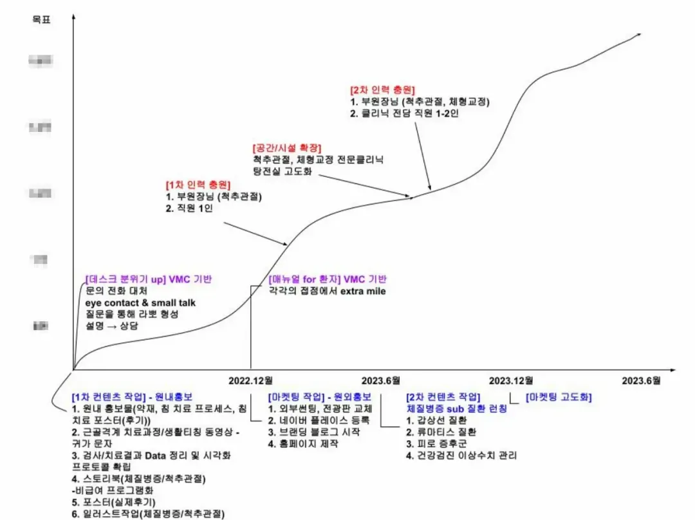

---
tags:
  - Session 01
  - 지표 경영
---

**원문 링크:** [https://medistream.co.kr/articles/86085](https://medistream.co.kr/articles/86085){:target="_blank"}

# Forecast Graph를 그리세요.

Forecast Graph 그려야 합니다.

-   **VMC:** Vision, Mission, Core value
    보라색은 직원들의 영역인데, VMC를 진료 현장에서 구체화해보자는 뜻으로 [VMC기반]이라는 꼬리를 달았습니다.
-   **Y축에는** 목표 매출이 작성되어 있습니다.

## 한의원을 하는 비전, 미션, 가치를 서술해주세요.

**2022 Vision** - 함께 성장하는 한의원
(2023 Vision - 지역을 대표하는 한의원, 2024 Vision - 지역을 넘어 전국구로)

**3-키워드:** 체질병증, 척추관절/ 감동을 줄 수 있는 사람/ 분기 매출

**Mission** - 사랑, 헌신, 봉사

-   자신에 대한 사랑
-   동료에 대한 헌신
-   환자에 대한 봉사

**Core value**

1.  **Extra mile - 감동을 줄 수 있는 사람이 되자 (공감과 소통)**
    -   병원을 찾는 환자를 위한 매뉴얼을 만든다. 내원환자의 불편을 줄이기 위해 만든 매뉴얼은 환자를 감동시키고 마음을 편안하게 한다.
    -   단순한 불친절은 원장의 진료 수준에 의해 자연스레 해소되기도 한다. 그러나 마음을 상하게 하는 불친절은 회복되기 어렵다.
    -   환자와 약속한 것은 아무리 큰 손해가 있어도 지킨다. 희생과 나눔을 통해 ‘고객과의 관계’를 잃어버리지 않는 쪽을 선택해야 한다.
    -   우리의 환자가 된 고객에게는 그 사람이 돈을 많이 주든 아니든, 그에게 좋은 것을 주기 위해 노력한다. 성실하고 일관성 있는 태도로 최선을 다하도록 한다. 나를 힘들게 하는 고객은 평생 따라다닌다. 두 번, 세 번 찾아와 고생시킨다. 그도 자신이 상대를 힘들게 한다는 사실을 안다. 사람에 맞추어주는 것이 아니라 똑같은 태도로 최선을 다한다. 봉사를 떠올리며 참아 주라. 그 사람도 내 행동을 보면서 참고 있다는 것을 알아챈다.
2.  **Cheer up - 긍정적인 마인드를 가진 동료들과 함께 성장한다.**
    -   유기적인 시스템
    -   동료들을 위해서 기꺼이 자신의 시간을 할애하는 것 - 후배 직원들을 돕기 위해 늘 자신의 시간을 대기시킨다. “언제든 무슨 문제든 가지고 와서 물으라” 일이 끝나도록 미리 미리 과정을 확인하고 후배들이 맡은 일을 잘해 내도록 돕는다. 일뿐만 아니라 후배들의 개인적인 어려움에 대해서도 세심하게 배려한다.
    -   서로의 성향과 장단점에 대해 이해하고, 서로의 성장 속도에 맞춰 적절하게 서로의 업무를 분담한다.
3.  **Who am I - 우리(나와 한의원)의 변하지 않는 정체성**
    -   상황이 뜻대로 풀리지 않았어도, 누군가 우리를 실망시켰더라도, 변하지 않는 나와 한의원의 정체성

---

## 6개월 OKR 설정

**Objective**

월매출 -원. 평환 -명 (실평환 -명). 직원 분기 인센티브 -만원

**Key result**

1.  **보험매출 -만원**
    -예약율 80%
    -초진이탈율 30%
    -삼진율 70%
    -원내 홍보물(침치료 프로세스, 침치료 포스터) 작성 완료
    -근골격계 치료과정/생활티칭 동영상 제작 완료
    -데스크 분위기 up 목표치(100%) 대비 실장 100%, 팀장 90%, 스탭 70% 달성 (매달 평가)
2.  **한약매출 -만원**
    -검사/치료결과 Data 정리 및 시각화 프로토콜 확립 완료
    -스토리북(체질병증/척추관절) 작성 완료
    -포스터(실제후기) 제작 완료
    -데스크 설명 위주에서 상담 위주로 마인드 리셋 훈련

