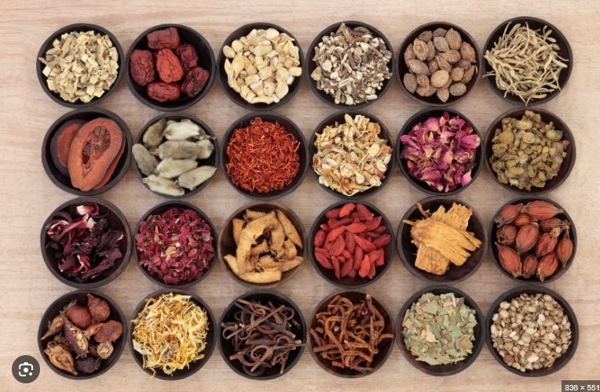

## 백영기 원장님 카톡
비급여가 너무 안나와서 고민입니다. 자연스럽게 공진단, 경옥고, 한약등으로 연결하는 방법이 없을까 고민중인데... 비슷한 고민을 하고 계신 원장님들도 계실것 같아 오늘 사례에 대해 원장님들의 의견듣고 싶어서 질문해봅니다. 등, 어깨 아파서 치료받는 50대 여환, 침치료 하면서 오늘은 좀 어떠신지? 경과 얘기하던 중 '등때문에 그런지 요즘 너무 피곤한거 같다' 얘기하심, '등 아프기전에도 피곤하셨냐?' 여쭤보니 '그런거 같다 일이 좀 힘들다' 하심. '잠 잘 주무시냐?' 여쭤보니 잠은 잘 주무신다고 하심. 그래서 '요즘 날씨도 덥고 (일도 힘들다고 하시니)체력이 많이 떨어지셔서 그런거 같다. 공진단이나 경옥고 드시면 도움이 된다. 저도 많이 피곤하면 아침에 공진단 하나씩 먹어요' 라고 말씀드리며 공진단 괜찮다고 은근한 어필함. 환자분이 아 전에 공진단 먹어봤어요 라고 하시길래 '드셔보셨을때 어떠셨어요?' 라고 물어보니 약간 모호하게 대답(크게 좋지도 나쁘지도 않았다 정도의 느낌으로). 이런 경우에 원장님들께서 이분이 공진단이나 경옥도 드시면 좋겠다는 판단이 든다면 어떻게 비급여로 연결을 시켜보실거 같으신지?? 저는 여기서 '피곤하시면 한번 드시는거 생각해보세요'정도로 얘기하고 나왔는데, 뭔가 자연스럽게 연결할수 있는 더 좋은 멘트나 아이디어가 있으신지 궁금합니다.
지난 강의떄 박정민 원장님이 기존 치료환자 녹용한약 결제 전환에 관한 인사이트 얘기하실때 환자의 니즈 파악(이 경우에는 피로감이 좋아지고 싶다는 거겠죠?)과 주치의 포지션(치료 하면서 다른것도 아픈지 확인하고 내가 치료해주겠다는 느낌?) 얘기를 해주셔서 환자들에게 다른데 아픈거 없는지 물어보고 있는데... 구체적으로 그다음에 어떤식으로 연결을 해야하는지가 막막합니다 ㅜㅜ

## 서재현 원장님
비급여는 상대에게 사도록 설득하는게 아니라 필요를 느끼게끔 해서 원하게 하는게 가장 중요한 것 같습니다
자기 확신이 가장 중요한거 같아요, 대상에게 이게 어떤어떤 효과가 있어서 좋아요 보다는 제 치료계획을 따라와주셨을 때 어떠어떠한 건강한 몸상태가 되도록 해드릴게요(환자가 원하는 자신의 미래 모습)을 연상시켜주는게 나름의 방법이 아닐까 생각해봅니다

저도 아직 부족한게 많긴 하지만 결국 비급여를 잘 권하려면 그 사람이 원장의 팬이 될 수 있도록 마음을 사는게 가장 중요한 것 같습니다

## 박정민 원장님
저도 비급여가 고민이지만ㅜㅜ 발표를 한 김에 의견을 말씀드리자면

저는 개인적으로, 주치의 포지션이 되서 '이 원장님이 내 몸을 제일 잘 아는 사람이다'라는 생각을 심어주는 게 중요한 것 같아요.
그래서 진단을 자꾸 해줍니다.

어차피 비급여를 안할 사람은 안하니까, 그러려니 하고요.
진단을 계속 해주다보면, 관심있는 환자들이 생기더라고요. 이럴 떄 관심있는 환자를 안 놓치는게 '니즈파악'의 영역인 거같습니다. 그리고 진단 근거가 쌓이니까 권유를 하더라도 자연스러워 집니다.

옴니핏 같은 의료기기 쓰는 것도 좋은 것 같습니다.
환자 상태를 진단해주기가 쉽잖아요~

저 상황이시라면 일단 진단부터 계속 해드리면 어떠실까요? 

예를들어
피곤하신 이유가 있으세요? 일이 왜 힘드세요? 
소화는요? 잠은요?
옴니핏 잠깐 해볼까요?

제가보니까 이런이런 상태네요. 

니즈 체크됨 -> 공진단 좀 드세요.
니즈 체크안됨 -> 몸 관리 잘하셔야죠. 잘챙겨드세요. 운동좀하세요 등등
애매함 -> 설득한다, 공진단을 소개해본다, 아무것도 안한다, 침이나 맞아보자고 한다 등등 선택

## 허조 원장님
저도 비급여가 많이 나가는 한의원은 아니지만 제가 했던 생각을 좀 공유해드릴게요.
비급여는 건강보험이 아니기 때문에 일반적으로 쉽게 구매하는 게 아니죠.
일단 비급여가 많이 나가려면 여기가 비급여가 많이 나가는 분위기인가가 중요합니다. 90년대에는 거의 모든 한의원이 비급여만 했다고들 하네요. 모두가 비급여를 하면 환자 본인도 비급여를 해야할것 같은 기분이 듭니다. 대부분의 현재 한의원은 사실 세팅을 급여로 했기 때문에 여기서 걸립니다. 급여를 포기할 수 없거든요.
여기서 환자가 비급여 필요를 못 느끼면 그 다음 원장이 상담으로 비급여를 이끌고 가야 합니다. 여기서 원장의 분위기 경험 기세 모든 것이 필요하겠죠.
여기서 원장이 끌고 나갈 힘이 없다면 그 다음 제품이 중요합니다. 그래서 잘 만든 제품 수, 린 다이어트 같은 제품이 비급여로 잘 나가겠죠.

그리고 저같은 경우는 한약의 필요성을 설명하고 그 뒤 절대 흐지부지하게 끝내지 않고 뒤에 확실히 조금 더 상담해드릴까요? 하고 끝맺음을 합니다. 여기서 환자가 상담을 하겠다고 하면 비급여 상담에 힘을 쏟아붓습니다.

제 글을 좀더 요약하자면
1. 한의원 분위기를 비급여로 세팅해야한다
2. 원장의 기세(경험, 능력)가 좋아야 한다
3. 좋은 제품을 써야한다 입니다

## 김연중 원장님
원장님들 비급여에 대한 생각에 많은 도움 받았습니다. 저는 어떻게 하는지 정리해봤습니다. 전환률이 매우 낮은데, 서재현 박정민 원장님처럼 생각해본 적이 없었던것 같습니다. 치료계획/원하는 미래모습 연상/진단 이라는 키워드가 매우 인상깊습니다.

호전도 떨어지면 태반or한약 권하는데, 네거티브라서 좋지 않은 방법인것 같습니다. 원장님들 조언을 참고해서 플롯을 개선해봐야겠네요.

저는 초진에 인바디 설명을 넣습니다. 체지방, 체수분, 위상각 보고 장기적인 관점에서 몸의 회복을 돕기위해 식사조절, 운동을 하셔야된다고 말씀드립니다. 치료받으면 증상이 좋아지겠지만, 재발을 막기 위해서는 몸의 환경을 개선시키라고 조언해드립니다. 내원을 장기적으로 하는 경우면, 다이어트 안하셔도 1달에 1번은 체크해보자고 말씀드리구요. 
몸의 구성 대한 인식을 초진부터 깔아서 효과를 보지 않았을까 싶습니다. 다들 설명드리면 좋아하시더라구요. /앞으로 붓기=한약이다 라는 컨셉으로 좀 더 밀어볼까 싶습니다. 처음부터 그럴 계획이었는데 입에 잘 안붙네요. 최근 한약환자분 비포에프터 봤을 때, 체수분도 많이 빠지셔서 자신감 가지고 밀어볼까 합니다.

*글쓰면서 생각해보니 식사, 운동, 붓기를 말씀드리는데 소화, 순환을 맥에 연결드려서 맥진도 추가해봐야겠네요. 니즈있으면 꽂아보게요.

치료하면서 호전도 떨어지거나, 일상 얘기하면서 한약=보약 니즈로 붙여서 설명하구요. 몸의 약한 부분 채워줘야 한다. 회복력 올려준다. /한약 얘기 했는데 별로 안좋아하시면 입 쏙 집어넣고 열심히 치료합니다.

저는 붠장때 한약+린다로 10kg정도 뺐었어서. 지금은 린다 안하지만 포스터 붙여놓고 있습니다. 다이어트 관련 얘기 나오면 좀 자신있는 편이라서, 그냥 잘된다고 합니다.

*뭔가 다이어트 한약 부담스러운 분들은 라인약침, 보약 부담스러운 분들은 태반약침이 좋은 조합인것 같습니다.

니즈가 있으면 검사 받고 상담 받아보시겠어요? 옴니핏 해드립니다. 한약 결제까진 안할것 같은데 내원 잘 하시는 분이면 기능검사 해드린다고 합니다. 좋아하십니다.

한약의 경우 위상각 떨어지거나, 옴니핏에서 누적피로도, 토탈파워 떨어지면 녹용권합니다. 증상 오래되면 연복하라고 말씀드립니다.

한약 상담 마지막에는 루틴처럼, 제가 직접 좋은 약재 골라오고. 조제하고, 직접 탕전한다. 녹용도 러시아 분골만 쓴다. 우리 한약 드시고 다들 좋아하신다. 아침에 눈 뜰 때, 번쩍 떠진다. /보약 관련 디스플레이, 정보접근성을 늘리려 노력중입니다. 일 진행도가 넘 느리네요..

저같은 경우, 비급여는 압박감을 견딜 수 있는가, 도전할건가의 마음가짐도 중요했던것 같습니다. 좋아지나? 내가 개선시킬 수 있는가, 호전이 될건가, 얼마나 걸릴건가 등. 지금은 기계(인바디 옴니핏)에 의존을 많이 하는 것 같네요. 부족한 부분 채워지면 좋아진다, 복진 맥진 체크해서 개선점 채우는것에 만족하는 것 같습니다. 예후잡아준다던데 주성완원장님 신상 강의 결제해놓고 아직 못봤습니다.. 김진상+주성완이 기틀인것 같습니다.

메디 어떤 글에서 봤는데, ‘그거 한약으로 잘 됩니다’를 입에 붙이는 부의가 계신다고.. 몇 번 따라해보고 있습니다.
저도 사슬람님 글도 엄청 인상깊게 봤습니다 ㅎㅎ 정대표님이 커뮤보지말랬는데..허허. 기세=멘탈은 철학적인 부분이 중요한건가 싶네요.

**비급여
검사기기: 인바디(위상각->3개월 이상 연복), 옴니핏(자율신경 맥파 뇌파) 한약설문지 복진 맥진.
->연복 권할때는 위상각 도움이 쏠쏠한 것 같습니다. 동일한 나이대의 사람들 중에서 중간은 가야하는데 하위권이다/꼴등이다. 위상각은 세포에 전기자극을 줬을 때 얼마나 잘 반응하는지를 본다. 세포기능을 보는데 쉽게 말해서 면역력이다.
->붓기가 많다. 어디에 몰려있다. 순환력이 떨어진다. 공장이 덜 돌아간다.
->옴니핏: 교감신경은 엔진에 시동거는거다. 이게 비율상 떨어져서 뭘 하려고 하면 선뜻 시작이 안된다. 시동이 안걸린다. 부교감은 안정시키는건데, 지금은 둘 다 기능이 떨어진 상태다. 몸 전체를 조절하기 때문에 증상은 사람마다 다 다르다. ㅇㅇㅇ님의 경우에는 ~~~증상으로 나타난거다. 스트레스가 많고, 누적피로도가 높다. 몸 전체의 에너지도 떨어진 상태다. 뇌파는 집중도가 떨어진 상태고, 수면의 질이 떨어졌다. 수면이 안되면 몸의 회복이 안된다. 계속 손상된 채로 방치된다.

한약 처방 대부분이 녹용인건 기기 도움이 큰것 같습니다. 치료보다는 보약니즈로 많이 접근하기도 하구요.

## 김준석 원장님
제가 비급여가 10년간 비슷비슷하다가 작년부터 올해사이에 2~3배 늘었는데 팁을 몇가지 풀어보겠습니다. (아직은 많이 부족한 매출입니다)

1. 진단기기 : 옴니핏, 체열검사
 수양명기기는 왠만하면 가지고 계실거고 체열검사 이거 강추합니다. 색으로 표현되기 때문에 충격받는 환자들 꽤 있습니다. 

2. 한약은 무조건 녹용 그리고 3개월 패키지
 저는 모든 한약 환자에게 3개월 드시라고 말씀드립니다. 돈없다고 해도 3개월 드시라고 합니다. 첩건도 3개월 말씀드립니다. 정말 어쩔수 없으면 1개월 처방 나갑니다. 한약 먹을 돈이 없지 홍삼 흑염소 루테인 먹을 돈은 있고 골프칠 돈 있고 피부관리 네일아트할 돈 있습니다.  6개월 패키지는 아직 경험이 없는데 해보려고 합니다. 
 그리고 녹용의 효능을 강조합니다. 녹용먹기 싫고 일반한약 해달라? 그러면 첩건이 가능한지 체크하고 첩건으로 돌립니다.  첩건이 안된다? 그러면 일반한약+녹용경옥고라도 밉니다. 녹용은 다 씁니다. 삼황사심탕가녹용, 양격산화탕가녹용 등등. 

3. 재진 치료 후 원장실로 모셔서 상담해보기 
 잘 안낫는 환자, 한약이 필요해보이는 환자 후상담합니다. (모든 환자가 한약이 필요하다고 생각합니다ㅎㅎ) 여기서도 매출이 가끔 나옵니다. 매출이 나오지 않아도 환자의 생각, 니즈를 알 수 있는 좋은 기회라고 생각합니다. (환자 몰릴 땐 로딩이 좀 빡십니다 ㅠ)

4. 가격은 3~4단계로
 녹용 가격을 한가지만 하지 마시고 3~4개로 하시고 원장님 주력 상품을 중간 가격대에 배치해보세요. 심리상 탕수육 중짜 시킵니다. 대짜 시키시는 분들도 꽤 계십니다. 

상담의 기술은 위의 원장님들께서 잘 설명해주신 것 같습니다. 환자의 고민과 불편함을 잘 캐치하고 해소시켜 주시면 될 것 같습니다.

## 서유리 원장님
비급여에 대한 원장님들 팁 너무 잘 봤습니다. 저의 경우는
1. 진료실내에 환자가 진료시 잘 보이는곳에 약 한달정도동안 처방된 탕약 파우치를 날짜와 성함 일부를 적어서 탕약이 잘 나가는곳이라는 이미지를 주려고합니다 
2. 대기실 사이니지에 역시 최근에 처방된 탕약 리스트(나이 성별 주소증)을 적어 놓고 계속 돌려가면서 이런 이런 증세에 한약을 복용하실수 있고 우리한의원은 어떤처방을 많이한다는 인식을 심어드리고 있습니다  
3. 초진시 내원하는 환자분께 쌍화탕이나 생맥산을 한포씩 드리면서 데스크 직원이 "한의원내에서 좋은 약재로 직접 달인 약"임을 강조하여 설명드리고 있습니다 
4. 그리고 광고로는 예전에 브랜드블로그를 2달정도 했는데  투자금액 대비 1.5배는 매출이 나온것같은데 워낙 금액이 부담 되어서 더 이상 못했구요.주변아파트 엘레베이터 내에 동영상 광고(타운보드 )는 3~4달했던것같고 여기서 다이어트 광고로 환자 유입이 어느정도 되서 투자대비 2~3배는 매출이 나왔던것같습니다 

저는 주로 권유나 니즈파악 보다는 분위기를 만들고 광고에 좀 집중했던것같아요